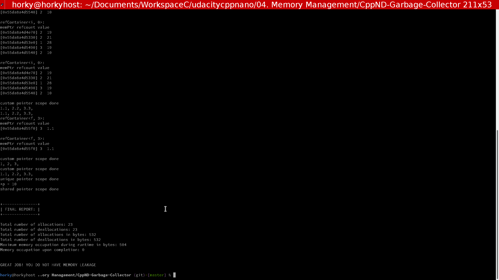

# CppND-Garbage-Collector

Memory Management course

## Project TODO List

- [x] Complete `Pointer` constructor
- [x] Complete `Pointer` `operator==`
- [x] Complete `Pointer` destructor
- [x] Complete `PtrDetails` class

## To setup and compile

1. Clone repository

```bash
git clone https://github.com/Horki/CppND-Garbage-Collector
```

2. Compile and run

- Make a build directory with `mkdir build`.
- Change into the build directory, `cd build`.
- Compile the project, `cmake .. && make`.
- Run the project `./gc`.

Garbage Collector example


