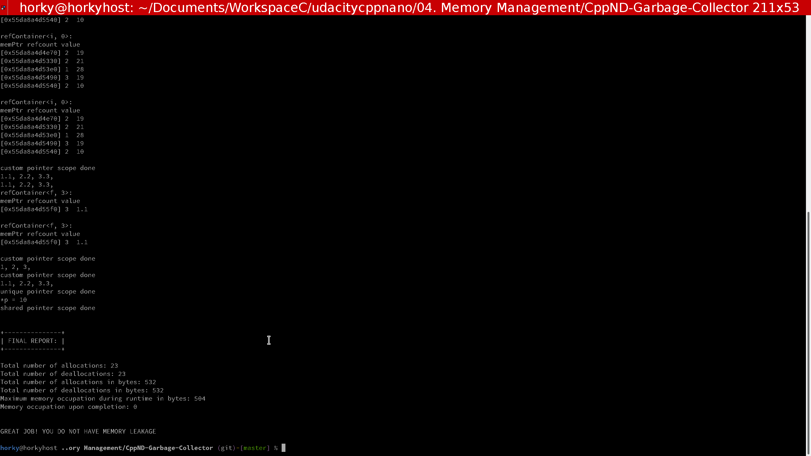

# CppND-Garbage-Collector

Memory Management course

## Project TODO List

- Complete `Pointer` constructor  [done]
- Complete `Pointer` `operator==` [done]
- Complete `Pointer` destructor   [done]
- Complete `PtrDetails` class     [done]

## To setup and compile

1. Clone repository

```bash
git clone https://github.com/Horki/CppND-Garbage-Collector
```

2. Compile and run

- Make a build directory with `mkdir build`.
- Change into the build directory, `cd build`.
- Compile the project, `cmake .. && make`.
- Run the project `./gc`.

Garbage Collector example

